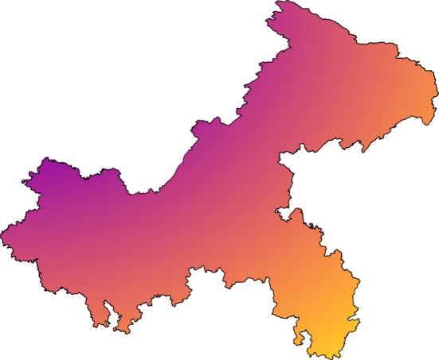

# mapbox-gl-static-image-source

[English](README.md) | 中文

通过 ol/reproj 加载任意投影的静态图片。

## 安装
```
npm i mapbox-gl-static-image-source
```

## 使用
这是一张 EPSG:4326 的图片：



```
import StaticImageSource from 'mapbox-gl-static-image-source'

map.on('load', () => {
  const imageStaticSource = new StaticImageSource({
    crossOrigin: 'anonymous',
    url: '/4326.png', // 图片的地址
    projection: 'EPSG:4326', // 图片的投影
    imageExtent: [105.289838, 28.164713, 110.195632, 32.204171] // 图片的范围
  })
  imageStaticSource.addEventListener('load', (e) => {
    map.addSource('canvas-source', e.target)
    map.addLayer(
      {
        id: 'canvas-layer',
        type: 'raster',
        source: 'canvas-source',
      },
      'waterway'
    )
  })
})
```

渲染效果: [](./example/index.html)
